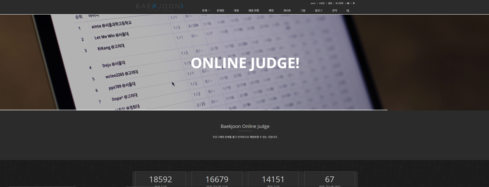
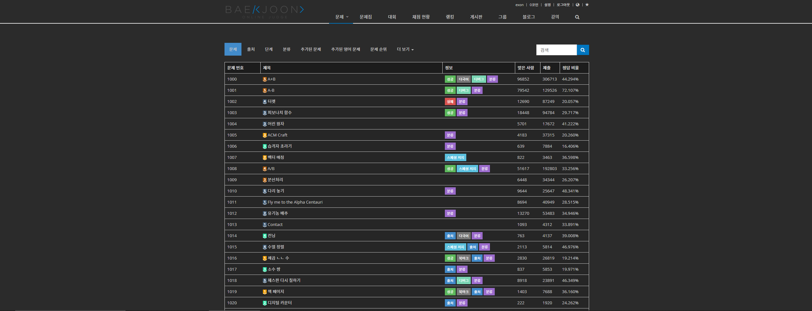

# DarkAlgo
백준 다크다크 확장 프로그램

## 사용법
1. [DarkAlgo](https://chrome.google.com/webstore/detail/darkalgo/denihfakafbbponodcpmchiglahicadg?hl=ko&) 확장 프로그램을 설치한다.

## Preview (v1.2.4)
   

 

## 이슈와 PR은 환영입니다!
+ 이슈를 보내주실 때 변경하고 싶은 부분을 캡처해서 보내주세요